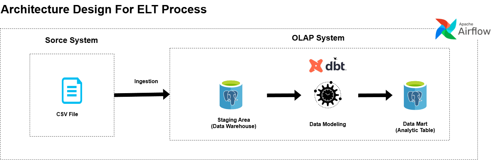

# Coraline Assigment : ELT + dbt Pipeline

This project demonstrates an end-to-end **ELT (Extract, Load, Transform) data pipeline** using  
**Apache Airflow, PostgreSQL, dbt, and Docker**.

The pipeline ingests CSV data, loads it into a data warehouse, and transforms it into analytics-ready tables using dbt — following modern data engineering best practices.

---

## Project Objectives

- Build a **reproducible ELT pipeline**
- Clearly separate **data ingestion** and **data transformation**
- Use **Airflow** for orchestration and scheduling
- Use **dbt** for transformations and testing

---

## Repository Structure
```text
.
├── airflow
│   ├── Dags
│   │   ├── __pycache__/
│   │   └── elt
│   │       ├── __pycache__/
│   │       ├── config.py
│   │       ├── db.py
│   │       ├── load_csv.py
│   │       └── elt_dbt_dag.py
│   └── Dockerfile
│
├── data
│   └── FoodSales.csv
│
├── dbt
│   ├── custom_model
│   │   ├── analyses/
│   │   ├── logs/
│   │   ├── macros/
│   │   ├── models
│   │   │   └── custom_table/
│   │   ├── seeds/
│   │   ├── snapshots/
│   │   ├── target/
│   │   ├── tests/
│   │   ├── dbt_project.yml
│   │   └── README.md
│   │
│   ├── profiles
│   │   └── profiles.yml
│   │
│   └── Dockerfile
│
├── design
│   └── architecture.drawio.png
│
├── test
│   └── test_result.ipynb
│
├── .env
├── .gitignore
├── docker-compose.yaml
├── README.md
└── run_pipeline.sh

```

---

## Architecture Design

The system follows a **modern ELT architecture**:

### 1. Extract & Load
- CSV data is loaded directly into **PostgreSQL**
- Acts as the **raw / staging layer**

### 2. Transform
- **dbt** transforms raw data into analytics models
- Transformations run inside the data warehouse

### 3. Orchestration
- **Airflow** controls execution order, retries, and scheduling

### 4. Infrastructure
- All components run in **Docker containers**
- Ensures consistency and reproducibility

📐 **High-level Architecture:**
<p align="center">
  
</p>

---

## How It Works

### 1. Data Ingestion (ELT Step)
- `FoodSales.csv` is mounted into Airflow containers
- `PythonOperator` executes `load_csv.py`
- Data is loaded into **PostgreSQL (data warehouse)**
- Acts as the **raw / staging layer**


### 2. Data Transformation (dbt Step)
- dbt runs inside a **custom Docker image**
- Uses `profiles.yml` for warehouse connection

**Models**
- `food_sales` → base model
```sql

select * 
from {{ source('challenge', 'food_sales') }}

```
- `cat_reg` → aggregated analytics model
```sql

select
    category
    , round(sum(case when region = 'East' then totalprice::numeric else 0 end)) as East
    , round(sum(case when region = 'West' then totalprice::numeric else 0 end)) as West
    , round(sum(totalprice)) as Grand_Total
from {{ ref('food_sales') }}
group by category
order by category

```

dbt handles:
- Transformations
- Schema tests
- Materialization

### 3. Orchestration (Airflow DAG)

**DAG:** `elt_dbt_pipeline`

```text
elt_load_csv  →  dbt_run
```
### Key Design Decisions

- dbt runs in Docker → consistent runtime
- Airflow handles orchestration only
- No transformation logic in Python
- Environment-driven configuration
- Separation of raw, model, and analytics layers

---

## How It Starts (Pipeline Bootstrap Flow)

The pipeline is started using a bootstrap script:

```bash
./run_pipeline.sh
```

## run_pipeline.sh – Execution Steps
### Step 0: Check Source Data

- Verifies that **FoodSales.csv** exists on the host machine
- Stops execution immediately if the file is missing

Step 1: Build dbt Image
```bash
docker build -t custom-model-dbt:latest dbt/
```
- Ensures a consistent and reproducible dbt environment
  

### Step 2: Initialize Airflow
```bash
docker-compose up airflow-init -d
```
- Prepares the Airflow metadata database


### Step 3: Start Services
```bash
docker-compose up -d
```
- Starts Airflow services, PostgreSQL, and required Docker networks

### Step 4: Verify Data Mount
```bash
docker exec airflow-webserver sh -c "ls /data"
docker exec airflow-scheduler sh -c "ls /data"
```
- Confirms that the CSV file is correctly mounted and visible inside the containers

### Step 5: Unpause DAG
```bash
docker exec airflow-webserver airflow dags unpause elt_dbt_pipeline
```
- Enables the DAG so it can be executed

### Step 6: Manual Trigger
```bash
docker exec airflow-webserver airflow dags trigger elt_dbt_pipeline
```
- Performs the first controlled execution
- After this, scheduled runs take over automatically
  
---

## Scheduling Strategy

- The DAG is scheduled to run **@daily**
- `catchup` is set to **False** to prevent backfilling of past runs
- The **first run is triggered manually** to ensure controlled initial execution
- **Subsequent runs execute automatically** according to the defined schedule

---

## Getting Started
### Prerequisites
- Docker
- Docker Compose
- Bash shell (Linux / macOS / Git Bash)

### Run the Pipeline
```bash
chmod +x run_pipeline.sh
./run_pipeline.sh
```
---
## Verify Results
### Option 1: Check Directly in PostgreSQL
- You can inspect the transformed data by connecting to the data warehouse container:

```bash
docker-compose exec -it data_warehouse psql -U root -d challenge
```

- Then run SQL queries:
```sql
SELECT * FROM food_sales;
SELECT * FROM cat_reg;
```

### Option 2: Run Test Notebook
You can also validate results by running the Jupyter notebook:
```bash
./test/test_result.ipynb
```
This notebook connects to the database and displays query results for verification.

--- 
## Future Improvements
- Add data quality checks at ingestion
- Add dbt tests to Airflow visibility
- Implement backfill strategy
- Add monitoring and alerting

--- 
***For Assignemnt Propose***, You can access the project enviornment variable in :
```bash
.env
```